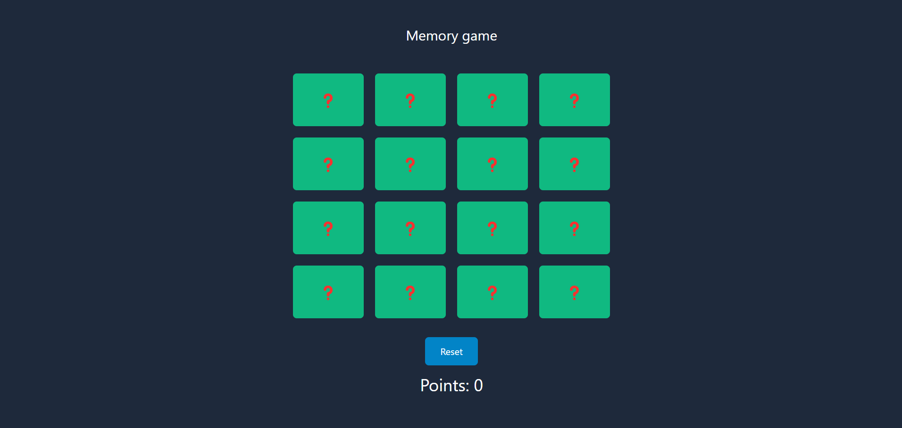

# Memory game

It's a simple memory game created in react.  

## Demo

https://szafter12-memorygame.netlify.app/


## Run Locally

Clone the project

```bash
  git clone https://github.com/Szafter12/Memory-game-react
```

Go to the project directory

```bash
  cd Memory-game-react
```

Install dependencies

```bash
  npm install
```

Start the server

```bash
  npm run dev
```


## Screenshots




## Tech Stack

- React
- TailwindCSS
- Vite


## Authors

- [@Jakub Pachut](https://github.com/Szafter12)

